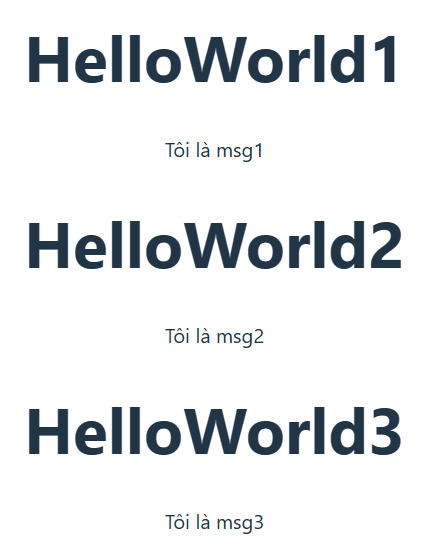

Khi chúng ta muốn các component có cùng layout nhưng nội dung trong chúng khác nhau, lúc này chúng ta sẽ sử dụng tới `props`

`props` giúp chúng ta tạo ra những thuộc tính để gắn cho một component. Ví dụ để có thể truyền title cho 1 component, ta sẽ định nghĩa danh sách các `props` mà các component này được phép chấp nhận. Để làm điều này ta sử dụng `defineProp()`

- **Component HelloWorld.vue**

```js
<script setup>
defineProps(["title", "msg"]);
</script>
<template>
  <div>
    <h1>{{ title }}</h1>
    <p>{{ msg }}</p>
  </div>
</template>
<style></style>
```

- **App.vue**

```js
<script setup>
import HelloWorld from "./components/HelloWorld.vue";
</script>

<template>
  <div>
    <HelloWorld title="HelloWorld1" msg="Tôi là msg1" />
    <HelloWorld title="HelloWorld2" msg="Tôi là msg2" />
    <HelloWorld title="HelloWorld3" msg="Tôi là msg3" />
  </div>
</template>

<style scoped></style>
```

- **Result:**



`defineProps()` chỉ có thể sử dụng trong `<script></script>`, không cần phải `import`,

`defineProps()` trả về một object bao gồm các prop được truyền cho component, ta có thể xem nó thông qua JS nếu cần thiết

Sử dụng `v-for` để đơn giản hóa việc truyền prop cho component

- **Component HelloWorld.vue**

```js
<script setup>
defineProps(["title", "msg"]);
</script>
<template>
  <div>
    <h1>{{ title }}</h1>
    <p>{{ msg }}</p>
  </div>
</template>
<style></style>
```

- **App.vue**

```js
<script setup>
import { ref } from "vue";
import HelloWorld from "./components/HelloWorld.vue";
const posts = ref([
  { id: 1, title: "My HelloWorld", msg: "My message!" },
  { id: 2, title: "My Blog", msg: "Do you like me?" },
  { id: 3, title: "My Insta", msg: "It's so boring" },
]);
</script>

<template>
  <div>
    <HelloWorld
      v-for="post in posts"
      :key="post.id"
      :title="post.title"
      :msg="post.msg"
    />
  </div>
</template>

<style scoped></style>

```

- **Result:**


### **[Full Guide About Props](https://vuejs.org/guide/components/props.html)**
